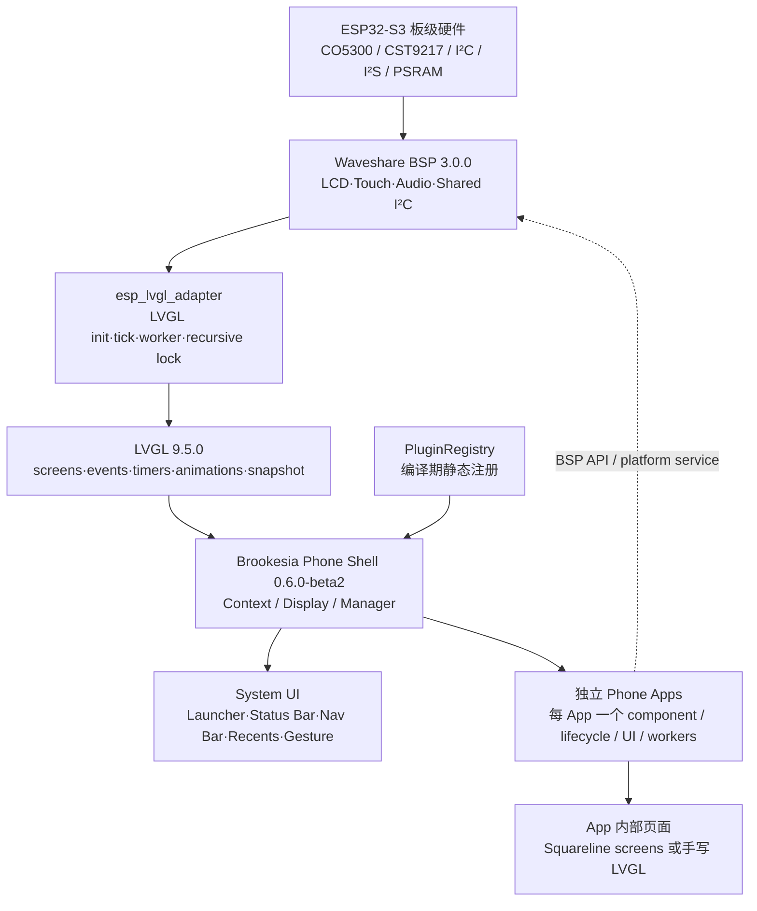
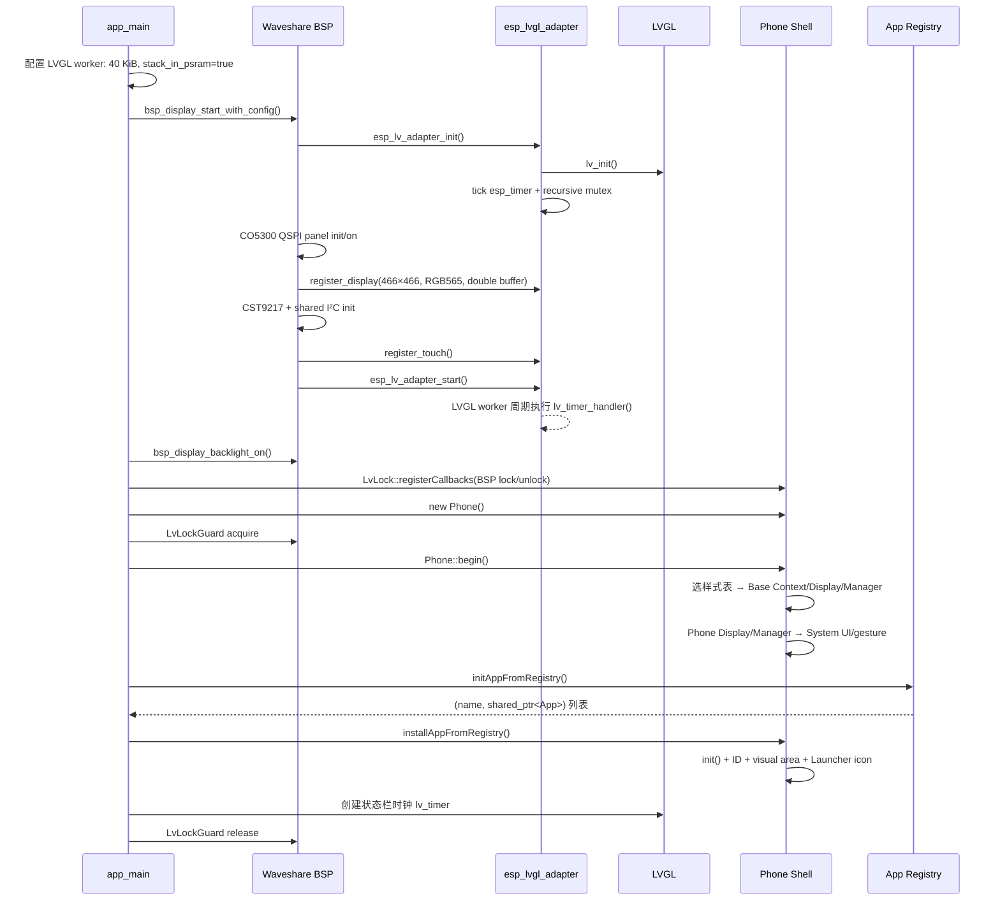
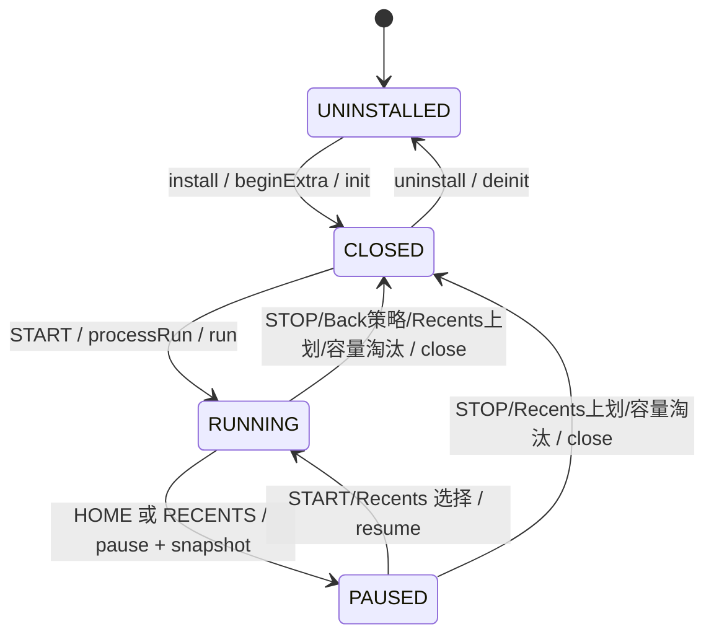

# ESP-Brookesia Phone 独立 App 通用架构研究

> 研究对象：`examples/esp-idf/99_esp-brookesia` 及其当前工作树内依赖源码  
> 目标：为后续开发任意独立 Brookesia Phone App 建立可复用架构地图；本文不是 App 模板，也不把现有 Squareline 页面误当成多个 App。  
> 证据标记：`[源码确认]` 表示当前工作树可直接证明；`[合理推断]` 表示由已确认调用链或平台行为推导；`[需上板验证]` 表示必须在目标板和实际固件上测量或验证。

## 执行摘要

1. **版本边界**：`[源码确认]` 本项目使用本地 `brookesia_core 0.6.0-beta2` 和 LVGL `9.5.0`，属于 ESP-Brookesia **legacy Phone Shell** 架构，不是当前上游文档所述的新 System Core/System Runtime App 模型。开发本分支必须以本地 API 和 release/v0.6 文档为准，不能把 latest API 直接替换进来（`examples/esp-idf/99_esp-brookesia/components/brookesia_core/idf_component.yml:1-2,25-28`；[上游版本说明](https://docs.espressif.com/projects/esp-brookesia/en/latest/getting_started.html)；[当前上游 App Model，仅用于识别版本漂移](https://docs.espressif.com/projects/esp-brookesia/en/latest/system/core/app_model.html)）。
2. **启动与安装分离**：`[源码确认]` `app_main` 先启动 BSP/LVGL/LCD/触摸，再注册 Brookesia GUI 锁，随后 `Phone::begin()` 初始化 Shell，最后从静态注册表发现并安装 App。安装只建立 ID、元数据和 Launcher 图标；用户点击图标后才首次调用 `run()`，Squareline UI 也到此时才创建（`examples/esp-idf/99_esp-brookesia/main/main.cpp:23-90`；`examples/esp-idf/99_esp-brookesia/components/brookesia_core/systems/base/esp_brookesia_base_manager.cpp:142-208,211-258`）。
3. **App 单位**：`[源码确认]` 一个独立 App 是一个继承 `esp_brookesia::systems::phone::App`、完成静态插件注册的 ESP-IDF component。现有 Splash、Clock、Call、Chat、Music、Weather、Alarm 是 **同一个 Squareline App 内的七个 LVGL screen**，不是七个 App（`examples/esp-idf/99_esp-brookesia/components/brookesia_app_squareline_demo/esp_brookesia_app_squareline_demo.hpp:17-79`；`examples/esp-idf/99_esp-brookesia/components/brookesia_app_squareline_demo/ui/ui.c:27-147,321-337`）。
4. **生命周期语义**：`[源码确认]` `init()` 在安装时调用；首次启动或关闭后重开调用 `run()`；Home 只 `pause()`；后台 App 再打开调用 `resume()`；Back 的策略由 App 的 `back()` 决定；Recents 可恢复或关闭；`close()` 后仍是已安装状态，只有卸载才调用 `deinit()`（`examples/esp-idf/99_esp-brookesia/components/brookesia_core/systems/base/esp_brookesia_base_app.cpp:342-536`；`examples/esp-idf/99_esp-brookesia/components/brookesia_core/systems/phone/esp_brookesia_phone_manager.cpp:559-642,1049-1179`）。
5. **责任边界**：`[源码确认]` Shell 负责 Launcher、Status Bar、Navigation Bar、Recents、手势、App ID/状态、屏幕切换、截图及已记录 LVGL screen/timer/animation 的清理。`[合理推断]` App 自己负责页面栈、数据、FreeRTOS worker、队列/事件、传感器/音频/网络会话和一切未被记录的资源，必须在 pause/close/cleanResource 中正确收束。
6. **并发红线**：`[源码确认]` LVGL 非线程安全；LVGL worker 自己持有递归锁执行 `lv_timer_handler()`。任何外部任务调用 `lv_*` 都必须使用 `LvLockGuard` 或 `bsp_display_lock()`；生命周期与 LVGL 回调在 GUI 调用链上不应做长耗时 I/O（BSP 明示：`examples/esp-idf/99_esp-brookesia/managed_components/waveshare__esp32_s3_touch_amoled_1_75c/include/bsp/esp32_s3_touch_amoled_1_75c.h:184-190`；worker：`examples/esp-idf/99_esp-brookesia/managed_components/espressif__esp_lvgl_adapter/src/adapter/esp_lv_adapter.c:1632-1684`；[LVGL 9.5 threading](https://lvgl.io/docs/open/9.5/integration/overview)）。
7. **最大资源风险**：`[合理推断]` 一张 466×466 RGB565 全屏截图像素数据约 `434,312 B ≈ 424.13 KiB`；默认最多三个 running App，仅截图像素即可约 `1.24 MiB`，未计 UI、ext draw、对齐、碎片和字体/图像。`[需上板验证]` 实际 PSRAM 落点、峰值、碎片及反复 Home/Recents/close 的稳定性。
8. **已确认高风险缺陷**：`[源码确认]` `saveAppTheme()` 保存到 `_app_style.theme`，但 `loadAppTheme()` 读取 `_display_style.theme`，恢复 App 时很可能装回 Shell theme；`[源码确认]` running/Recents 逻辑把 `unordered_map` 迭代顺序当作新旧顺序，所谓 “oldest” 与 Recents 排序并不可靠（`examples/esp-idf/99_esp-brookesia/components/brookesia_core/systems/base/esp_brookesia_base_app.cpp:741-775`；`examples/esp-idf/99_esp-brookesia/components/brookesia_core/systems/base/esp_brookesia_base_manager.hpp:117-121`；`examples/esp-idf/99_esp-brookesia/components/brookesia_core/systems/base/esp_brookesia_base_manager.cpp:232-243,470-523`）。
9. **固件上限**：`[源码确认]` 当前分区表只有一个 4 MiB factory App，无 OTA slot、无文件系统分区。所有静态链接 App、图像和字体共同竞争这 4 MiB；32 MiB flash 的其余大部分尚未分区（`examples/esp-idf/99_esp-brookesia/partitions.csv:1-5`；`examples/esp-idf/99_esp-brookesia/sdkconfig.defaults:1-12`）。当前没有可用 App ELF/BIN/MAP，因此不能声称已有固件大小或余量。

## 总体架构图



`[源码确认]` Base Context 创建 main/system 两个 screen，并把 system screen 设为 `display->sys_layer`；Phone Display 再将 Recents、Status Bar、Navigation Bar 与 Launcher 安装到这两个系统层级中（`examples/esp-idf/99_esp-brookesia/components/brookesia_core/systems/base/esp_brookesia_base_display.cpp:136-186`；`examples/esp-idf/99_esp-brookesia/components/brookesia_core/systems/phone/esp_brookesia_phone_display.cpp:37-81`）。

---

## 1. 启动顺序：`app_main`、BSP、LVGL 与 Phone Shell

### 1.1 启动时序图



### 1.2 实际调用链

`[源码确认]` 当前入口的严格顺序为：

```text
app_main
  ├─ ESP_LV_ADAPTER_DEFAULT_CONFIG
  │    ├─ task_stack_size = 40 KiB
  │    └─ stack_in_psram = true
  ├─ bsp_display_start_with_config
  │    ├─ esp_lv_adapter_init
  │    │    ├─ lv_init
  │    │    ├─ LVGL tick esp_timer
  │    │    └─ recursive LVGL mutex / auxiliary sync
  │    ├─ bsp_display_lcd_init
  │    │    ├─ SPI/QSPI + CO5300 reset/init/on
  │    │    └─ esp_lv_adapter_register_display
  │    ├─ bsp_display_indev_init
  │    │    ├─ bsp_touch_new → bsp_i2c_init → CST9217
  │    │    └─ esp_lv_adapter_register_touch
  │    ├─ brightness init
  │    └─ esp_lv_adapter_start → LVGL worker
  ├─ bsp_display_backlight_on
  ├─ LvLock::registerCallbacks(bsp_display_lock/unlock)
  ├─ new Phone
  └─ LvLockGuard
       ├─ Phone::begin
       ├─ initAppFromRegistry
       ├─ installAppFromRegistry
       └─ lv_timer_create(status-bar clock)
```

入口证据：`examples/esp-idf/99_esp-brookesia/main/main.cpp:20-90`。BSP 内部链路：`examples/esp-idf/99_esp-brookesia/managed_components/waveshare__esp32_s3_touch_amoled_1_75c/esp32_s3_touch_amoled_1_75c.c:382-455,458-512,518-548`。Adapter 初始化和 worker 创建：`examples/esp-idf/99_esp-brookesia/managed_components/espressif__esp_lvgl_adapter/src/adapter/esp_lv_adapter.c:556-635,679-737`。

### 1.3 `Phone::begin()` 内部

`[源码确认]` `Phone::begin()`：若没有样式表则加入默认 dark；按实际 display size 查找样式；依次调用 `base::Context::begin()`、Phone Display `begin()`、Phone Manager `begin()`（`examples/esp-idf/99_esp-brookesia/components/brookesia_core/systems/phone/esp_brookesia_phone.cpp:38-74`）。Base Context 创建 LVGL 事件对象/自定义事件码并启动 Base Display/Manager（`examples/esp-idf/99_esp-brookesia/components/brookesia_core/systems/base/esp_brookesia_base_context.cpp:182-238`）；Phone Display 创建系统 UI（`examples/esp-idf/99_esp-brookesia/components/brookesia_core/systems/phone/esp_brookesia_phone_display.cpp:37-81`）；Phone Manager 获取默认 pointer indev、创建 Gesture 并接入 Launcher/Nav/Recents（`examples/esp-idf/99_esp-brookesia/components/brookesia_core/systems/phone/esp_brookesia_phone_manager.cpp:47-147`）。

`[源码确认]` 面板实际是 466×466，而专用样式表是精确 480×480；样式表管理器按分辨率键精确查找，所以当前会使用可按百分比校准的 default stylesheet，而不是 480×480 stylesheet（`examples/esp-idf/99_esp-brookesia/components/brookesia_core/systems/phone/stylesheets/480_480/dark/core_data.hpp:65-71`；`examples/esp-idf/99_esp-brookesia/components/brookesia_core/gui/style/esp_brookesia_gui_stylesheet_manager.hpp:252-308`）。`[需上板验证]` 466×466 上系统控件的实际几何、手势热区和视觉品质；Brookesia 自带文档也警告非专用分辨率效果可能非最佳（`examples/esp-idf/99_esp-brookesia/components/brookesia_core/docs/system_ui_phone_CN.md:20-36`）。

---

## 2. 编译期注册、依赖、名称、图标与 Launcher

### 2.1 注册/安装链

```mermaid
flowchart LR
    SRC["App .cpp 中静态注册宏"] --> OBJ["PluginRegistrar 静态对象"]
    OBJ --> WA["ESP-IDF component WHOLE_ARCHIVE"]
    WA --> FW["对象文件保留进固件"]
    FW --> BOOT["C++ 静态初始化 registerPlugin"]
    BOOT --> IR["initAppFromRegistry\nforEach + get(name)"]
    IR --> IA["installAppFromRegistry"]
    IA --> PI["App::processInstall\nbeginExtra + init + CLOSED"]
    PI --> ID["分配 App ID + visual area"]
    ID --> ICON["Phone Display addIcon"]
    ICON --> CLICK["Launcher LV_EVENT_CLICKED"]
    CLICK --> START["AppEvent START → Manager::startApp"]
    START --> RUN["run 或 resume"]
```



`[源码确认]` Squareline 使用：

```cpp
ESP_UTILS_REGISTER_PLUGIN_WITH_CONSTRUCTOR(
    systems::base::App,
    SquarelineDemo,
    APP_NAME,
    []() {
        return std::shared_ptr<SquarelineDemo>(
            SquarelineDemo::requestInstance(),
            [](SquarelineDemo *p) {}
        );
    }
)
```

对应源码为 `examples/esp-idf/99_esp-brookesia/components/brookesia_app_squareline_demo/esp_brookesia_app_squareline_demo.cpp:379-382`；宏展开成静态 `PluginRegistrar`，其构造函数调用 `PluginRegistry<BaseType>::registerPlugin`（`examples/esp-idf/99_esp-brookesia/managed_components/espressif__esp-lib-utils/src/more/esp_utils_plugin_registry.hpp:480-505,586-640`）。

`[源码确认]` component 的 `WHOLE_ARCHIVE` 是关键：静态 registrar 所在对象没有普通被引用符号时，普通静态库链接可能不抽取该对象；当前 CMake 明确要求 whole-archive（`examples/esp-idf/99_esp-brookesia/components/brookesia_app_squareline_demo/CMakeLists.txt:1-16`；[ESP-IDF 5.5 build system / WHOLE_ARCHIVE](https://docs.espressif.com/projects/esp-idf/en/v5.5/esp32s3/api-guides/build-system.html)）。缺失它的典型结果不是编译错误，而是运行时注册表中根本没有该 App。

### 2.2 最小依赖与元数据

- `[源码确认]` App manifest 只需公开依赖本地 component `brookesia_core`；现有形式见 `examples/esp-idf/99_esp-brookesia/components/brookesia_app_squareline_demo/idf_component.yml:1-4`。
- `[源码确认]` Phone App 基类是 `esp_brookesia::systems::phone::App`，最终继承 Base App（`examples/esp-idf/99_esp-brookesia/components/brookesia_core/systems/phone/esp_brookesia_phone_app.hpp:19-24`）。
- `[源码确认]` App 名称和 Launcher image 进入 `base::App::Config`；Phone config 还决定 Launcher 页、状态图标区、状态栏/导航栏模式及手势（`examples/esp-idf/99_esp-brookesia/components/brookesia_core/systems/base/esp_brookesia_base_app.hpp:28-76`；`examples/esp-idf/99_esp-brookesia/components/brookesia_core/systems/phone/esp_brookesia_phone_app.hpp:29-78`）。
- `[源码确认]` 安装时若 launcher icon 为空，Shell 替换为默认 icon，并调用 `_app_launcher.addIcon(page_index, info)`；页面满时会找空页或动态新建页（`examples/esp-idf/99_esp-brookesia/components/brookesia_core/systems/phone/esp_brookesia_phone_display.cpp:108-129`；`examples/esp-idf/99_esp-brookesia/components/brookesia_core/systems/phone/widgets/app_launcher/esp_brookesia_app_launcher.cpp:143-185`）。
- `[源码确认]` 点击图标发送 `AppEventType::START`，同步落到 `Manager::startApp()`（`examples/esp-idf/99_esp-brookesia/components/brookesia_core/systems/phone/widgets/app_launcher/esp_brookesia_app_launcher_icon.cpp:190-215`；`examples/esp-idf/99_esp-brookesia/components/brookesia_core/systems/base/esp_brookesia_base_manager.cpp:579-609`）。

### 2.3 名称、顺序与对象寿命约束

- `[源码确认]` generic registry 技术上允许同名不同类型，`get(name)` 只返回第一个匹配项（`examples/esp-idf/99_esp-brookesia/managed_components/espressif__esp-lib-utils/src/more/esp_utils_plugin_registry.hpp:119-139,480-505`）。`[合理推断]` 产品级 App 注册名必须唯一，否则发现结果、日志与 Launcher 语义含糊。
- `[源码确认]` registry 用 vector 存储并逐项遍历，但静态初始化/链接顺序不应作为产品排序契约；`installAppFromRegistry` 提供可选 `ordered_app_names` 重排（`examples/esp-idf/99_esp-brookesia/managed_components/espressif__esp-lib-utils/src/more/esp_utils_plugin_registry.hpp:66-84`；`examples/esp-idf/99_esp-brookesia/components/brookesia_core/systems/base/esp_brookesia_base_manager.cpp:164-208`）。`[合理推断]` 若 Launcher 顺序必须稳定，应显式传入顺序列表，而非依赖 component 链接顺序。
- `[源码确认]` Squareline registrar 返回 singleton，并使用 no-op deleter；因此该 C++ App 对象本身具有固件级寿命，而动态 LVGL UI 会在 close 后清理、下次 `run()` 重建（`examples/esp-idf/99_esp-brookesia/components/brookesia_app_squareline_demo/esp_brookesia_app_squareline_demo.cpp:26-39,379-382`）。这不是基类强制要求；新 App 仍应明确对象所有权。

---

## 3. 生命周期、Home、Back 与 Recents

### 3.1 Base lifecycle 状态机



`[源码确认]` Base App 的四个状态是 `UNINSTALLED/RUNNING/PAUSED/CLOSED`；`run()` 和 `back()` 为纯虚函数，其他 lifecycle hook 有默认空实现（`examples/esp-idf/99_esp-brookesia/components/brookesia_core/systems/base/esp_brookesia_base_app.hpp:78-85,219-333`）。

### 3.2 状态/事件表

| 事件或调用 | 前态 | Base lifecycle 语义 | Phone Shell 行为 | App 应做什么 |
|---|---|---|---|---|
| 安装 | `UNINSTALLED` | `[源码确认]` `beginExtra()` → `init()` → `CLOSED`；分配 ID | 校准 visual area、加入 Launcher | `init()` 做可跨多次打开复用的轻量初始化；不要在此假设 UI 已显示 |
| 首次启动/关闭后重开 | `CLOSED` | `[源码确认]` 保存 Shell screen/theme；开始资源记录；`run()`；保存 App screen；`RUNNING` | 配置系统栏、加入 Recents card、切换 APP screen | 创建 UI 根 screen/对象；启动必要 worker，但避免阻塞 GUI |
| Home | `RUNNING` | `[源码确认]` `pause()`；保存 App theme/screen；截图；恢复 Shell theme；`PAUSED` | 切回 MAIN，清空 active app；running map 保留 | 降低/暂停采样、网络刷新、音频；保留可恢复状态 |
| Recents 键/手势 | `RUNNING` | `[源码确认]` 先 pause、截图 | 显示 Recents 系统控件 | 同 Home 的暂停策略；Recents 不是 App 页面 |
| 从 Launcher/Recents 选择后台 App | `PAUSED` | `[源码确认]` 恢复 screen/theme；记录 `resume()` 新资源；`RUNNING` | 隐藏 Recents、恢复对应系统栏与 APP screen | 恢复 worker/订阅，做短小 UI 刷新；不重复创建整套 UI |
| Back | `RUNNING` | `[源码确认]` Base 只调用 App 的 `back()` | Shell 不替 App 决定页面栈 | 有内部页面则 pop；到根页才可 `notifyCoreClosed()` |
| Close/STOP | `RUNNING` 或 `PAUSED` | `[源码确认]` `close()`；`cleanResource()`；清理已记录 screen/timer/anim；恢复 Shell theme；`CLOSED` | 移除 Recents、状态图标和 running map；必要时切 MAIN | 先停止 worker/回调/硬件访问，再允许 UI 被删；释放非 LVGL 资源 |
| 卸载 | `CLOSED`（正常期望） | `[源码确认]` `deinit()` → `UNINSTALLED` | 移除 Launcher icon | 释放安装期资源；当前固件通常不做动态卸载 |

核心 wrapper 证据：`examples/esp-idf/99_esp-brookesia/components/brookesia_core/systems/base/esp_brookesia_base_app.cpp:342-536,623-659,686-800`；Manager run/resume/pause/close：`examples/esp-idf/99_esp-brookesia/components/brookesia_core/systems/base/esp_brookesia_base_manager.cpp:211-380`。

### 3.3 Home、Back、Recents 的精确语义

- **Home**：`[源码确认]` active App 被 `processAppPause()`，然后 Shell 切 MAIN 并 `resetActiveApp()`；App 仍在 running map，之后从 Launcher 点击会走 resume 而非 run（`examples/esp-idf/99_esp-brookesia/components/brookesia_core/systems/phone/esp_brookesia_phone_manager.cpp:593-602`；`examples/esp-idf/99_esp-brookesia/components/brookesia_core/systems/base/esp_brookesia_base_manager.cpp:216-225`）。
- **Back**：`[源码确认]` Shell 仅调用 `active_app->back()`（`examples/esp-idf/99_esp-brookesia/components/brookesia_core/systems/phone/esp_brookesia_phone_manager.cpp:585-592`）。现有 Squareline 的具体策略是立即 `notifyCoreClosed()`，即关闭整个 App，而非返回上一张 Squareline screen（`examples/esp-idf/99_esp-brookesia/components/brookesia_app_squareline_demo/esp_brookesia_app_squareline_demo.cpp:55-63`）。新 App 不应机械复制这一产品策略。
- **Recents**：`[源码确认]` 进入时 pause active App、取 snapshot、更新所有 card；点击/短滑恢复 START，上划 card 或垃圾桶发送 STOP（`examples/esp-idf/99_esp-brookesia/components/brookesia_core/systems/phone/esp_brookesia_phone_manager.cpp:603-635,1049-1211`）。Recents 是 Phone Shell widget，不是 Base App，也不是 Squareline page。
- **Close 与 uninstall 不同**：`[源码确认]` close 只从 running map 移除，保持 installed；uninstall 才执行 `deinit()` 并移除 Launcher（`examples/esp-idf/99_esp-brookesia/components/brookesia_core/systems/base/esp_brookesia_base_manager.cpp:88-120,352-380`）。

### 3.4 生命周期高风险点

1. **Theme 保存/恢复疑似确定性缺陷**：`[源码确认]` pause 时 `saveAppTheme()` 把当前主题写入 `_app_style.theme`，但 resume 的 `loadAppTheme()` 引用的是 `_display_style.theme`；这与字段意图不符（`examples/esp-idf/99_esp-brookesia/components/brookesia_core/systems/base/esp_brookesia_base_app.cpp:741-775`；字段见 `examples/esp-idf/99_esp-brookesia/components/brookesia_core/systems/base/esp_brookesia_base_app.hpp:445-454`）。`[合理推断]` App resume 实际可能恢复 Shell 原 theme，而非 App theme。`[需上板验证]` Squareline：run → Home → resume、Recents 切换、close → reopen 的主题和样式稳定性。
2. **“最老 App”并不可靠**：`[源码确认]` 达到 max running 时遍历 `unordered_map` 并把最后迭代元素称为 oldest；Recents index 同样用容器距离模拟顺序（`examples/esp-idf/99_esp-brookesia/components/brookesia_core/systems/base/esp_brookesia_base_manager.hpp:117-121`；`examples/esp-idf/99_esp-brookesia/components/brookesia_core/systems/base/esp_brookesia_base_manager.cpp:232-243,470-523`）。`[合理推断]` 淘汰和卡片顺序可能随 hash bucket/rehash 变化，而非 LRU/FIFO。
3. **active close 的清理是延迟的**：`[源码确认]` active App close 时资源清理挂在目标 screen 的 `LV_EVENT_SCREEN_UNLOADED`，不是 `close()` 返回时立刻完成（`examples/esp-idf/99_esp-brookesia/components/brookesia_core/systems/base/esp_brookesia_base_app.cpp:497-525,686-703,777-800`）。`[合理推断]` worker 必须在 `close()` 中先停住，不能等 `cleanResource()` 才停止对旧 UI 指针的访问。

---

## 4. 现有 Squareline App：component、UI、screen、资源与 theme

### 4.1 Component 结构

```text
components/brookesia_app_squareline_demo/
├── CMakeLists.txt                    # 递归收集 C/C++，WHOLE_ARCHIVE
├── idf_component.yml                 # public brookesia_core
├── esp_brookesia_app_squareline_demo.hpp
├── esp_brookesia_app_squareline_demo.cpp
├── assets/
│   ├── ...launcher...c               # 编译进固件的 LVGL image descriptor
│   └── ...launcher...png             # 设计源资源
└── ui/
    ├── ui.c / ui.h / ui_events.* / ui_helpers.*
    ├── screens/                      # 七个 LVGL root screen 的生成代码
    ├── components/                   # Squareline reusable UI components
    ├── images/                       # 17 个 C image descriptors/payloads
    └── fonts/ui_font_Number.c        # 66 px 自定义字体
```

`[源码确认]` CMake 递归纳入整个 component 下的 `.c/.cpp`，include root 为 component root，并启用 `WHOLE_ARCHIVE`（`examples/esp-idf/99_esp-brookesia/components/brookesia_app_squareline_demo/CMakeLists.txt:1-16`）。这意味着放入目录的生成源码/资源会自动静态链接进最终 image。

### 4.2 App wrapper

- `[源码确认]` 类继承 Phone App；公开 singleton；必须实现 `run()` 与 `back()`；其他 hooks 只是注释示例（`examples/esp-idf/99_esp-brookesia/components/brookesia_app_squareline_demo/esp_brookesia_app_squareline_demo.hpp:17-147`）。
- `[源码确认]` 名称为 `Squareline`，launcher icon 用编译期 descriptor；构造参数 `use_default_screen=false`，状态栏/导航栏默认都隐藏（`examples/esp-idf/99_esp-brookesia/components/brookesia_app_squareline_demo/esp_brookesia_app_squareline_demo.cpp:16-39`）。关闭 default screen 是因为 Squareline 自己创建并加载 root screens。
- `[源码确认]` `run()` 只调用 `phone_app_squareline_ui_init()`；`back()` 关闭整个 App（`examples/esp-idf/99_esp-brookesia/components/brookesia_app_squareline_demo/esp_brookesia_app_squareline_demo.cpp:45-63`）。

### 4.3 UI 初始化和内部 screen 路由

`[源码确认]` 生成文件来自 SquareLine Studio 1.5.0、目标 LVGL 9.1.0，而项目实际编译 LVGL 9.5.0（`examples/esp-idf/99_esp-brookesia/components/brookesia_app_squareline_demo/ui/ui.c:6-9`；`examples/esp-idf/99_esp-brookesia/components/brookesia_core/idf_component.yml:25-28`）。当前源码已做适配且能进入代码库，不等于未来重新导出仍自动兼容；升级/导出后必须重新编译和验证。

`[源码确认]` `phone_app_squareline_ui_init()` 对 default display 调用 `lv_theme_simple_init()` 并设置 **display-wide theme**，随后一次性初始化七个 screen 并载入 splash（`examples/esp-idf/99_esp-brookesia/components/brookesia_app_squareline_demo/ui/ui.c:321-337`）：

```text
phone_app_squareline_ui_init
  ├─ 安装 simple theme 到默认 display
  ├─ 创建 splash
  ├─ 创建 clock
  ├─ 创建 call
  ├─ 创建 chat
  ├─ 创建 music_player
  ├─ 创建 weather
  ├─ 创建 alarm
  └─ load splash
```

内部路由为：

```text
splash ──自动──> clock
                 ↔ call ↔ chat ↔ music_player ↔ weather ↔ alarm
                 └──────────────────────────────────────────↲
```

路由事件证据：`examples/esp-idf/99_esp-brookesia/components/brookesia_app_squareline_demo/ui/ui.c:166-310`。**这些是一个 App 的七个 screen/page，不是七个注册项、七个 Launcher icon 或七个 lifecycle。**

### 4.4 自动记录与 Squareline 动画

`[源码确认]` Base App 在 `run()`/`resume()` 前后自动调用 `startRecordResource()`/`endRecordResource()`，按 LVGL 全局列表差分记录新 root screen、timer、animation，close 时自动删除（`examples/esp-idf/99_esp-brookesia/components/brookesia_core/systems/base/esp_brookesia_base_app.cpp:64-213,215-340,405-470`）。

`[源码确认]` Squareline 动画是在后续 screen event 中创建，可能已经离开 lifecycle 自动记录窗口，因此 wrapper 在每次 `lv_anim_start()` 前后手动 bracket（`examples/esp-idf/99_esp-brookesia/components/brookesia_app_squareline_demo/esp_brookesia_app_squareline_demo.cpp:119-375`）。当前真实 API 名是 **`endRecordResource()`**（`examples/esp-idf/99_esp-brookesia/components/brookesia_core/systems/base/esp_brookesia_base_app.hpp:353-395`）；本地文档仍写 `stopRecordResource()`（`examples/esp-idf/99_esp-brookesia/components/brookesia_core/docs/how_to_use_CN.md:33-34,65-66`），属于文档与源码漂移，新代码必须以源码 API 为准。

### 4.5 静态资产与命名风险

- `[源码确认]` `ui.h` 声明 17 个 embedded images 与一个 `ui_font_Number`（`examples/esp-idf/99_esp-brookesia/components/brookesia_app_squareline_demo/ui/ui.h:152-176`）；这些 C 数组属于固件静态段，不会随 App close 回收。
- `[源码确认]` Launcher 文件名含 `112_112`，但 descriptor 实际是 **126×126 ARGB8888，data_size 63,504 B**（`examples/esp-idf/99_esp-brookesia/components/brookesia_app_squareline_demo/assets/esp_brookesia_app_icon_launcher_squareline_112_112.c:158-165`）。文件名不是运行时尺寸契约。
- `[源码确认]` 七个 screen、widgets、event helper 都大量使用外部全局 C 符号（`examples/esp-idf/99_esp-brookesia/components/brookesia_app_squareline_demo/ui/ui.c:19-155`）。`[合理推断]` 直接把多个默认 Squareline export 放入同一固件会发生链接期符号冲突。每个 App 的 screen、widget、init、event、helper、component 和资源名必须有 App 前缀；Brookesia 自带指南也明确如此（`examples/esp-idf/99_esp-brookesia/components/brookesia_core/docs/how_to_use_CN.md:45-66`；[release/v0.6 App guide](https://github.com/espressif/esp-brookesia/blob/release/v0.6/core/brookesia_core/docs/how_to_use.md)）。
- `[需上板验证]` 七屏 eager creation 的首次启动延时、峰值堆、close/reopen 后堆回收和动画 user-data 是否稳定。

---

## 5. 最小独立 App 目录与文件职责（说明，不创建模板）

### 5.1 最小目录图

```text
components/brookesia_app_<unique_name>/
├── CMakeLists.txt
├── idf_component.yml
├── esp_brookesia_app_<unique_name>.hpp
├── esp_brookesia_app_<unique_name>.cpp
├── assets/                            # 可选：launcher icon / App 静态资源
└── ui/                                # 可选：手写或生成 UI
    ├── app-prefixed init/screens/events
    ├── images/
    └── fonts/
```

`[合理推断]` 真正不可少的是 component 注册、manifest、App header/implementation 及一个静态 registrar；`assets/ui` 只在需要时存在。不要为了“以后可能”复制整个 Squareline 目录。

### 5.2 `CMakeLists.txt` 要点

`[源码确认]` 当前已验证模式是递归收集 C/C++、include component root、`WHOLE_ARCHIVE`（`examples/esp-idf/99_esp-brookesia/components/brookesia_app_squareline_demo/CMakeLists.txt:1-16`）。新 App 可按实际文件显式列 `SRCS` 或沿用小 component 的递归方式，但必须保留 registrar 所在 component 的 `WHOLE_ARCHIVE`。不要另造运行时 App 扫描器。

### 5.3 `idf_component.yml` 要点

```yaml
version: <component-version>
dependencies:
  brookesia_core:
    public: true
  # 仅加入实际使用的硬件/协议组件，例如 waveshare/qmi8658
```

这是结构说明，不是已创建模板。`[源码确认]` 现有 App 的公共依赖形式见 `examples/esp-idf/99_esp-brookesia/components/brookesia_app_squareline_demo/idf_component.yml:1-4`。`[合理推断]` 直接调用 BSP 通常可由主项目/Brookesia 依赖图提供头与链接，但为了 component 边界清晰，使用额外驱动的 App/共享服务应在其归属 component manifest 中显式声明实际依赖。

### 5.4 Header 最小契约

- 继承 `esp_brookesia::systems::phone::App`。
- 必须 override `bool run(void)` 与 `bool back(void)`。
- 按需 override `init/deinit/pause/resume/close/cleanResource`。
- 若延迟 callback 创建 LVGL resource，暴露或内部包装实际 API `startRecordResource()` / `endRecordResource()`。
- 保留所有 App 全局 C 符号的唯一前缀。

真实 API：`examples/esp-idf/99_esp-brookesia/components/brookesia_core/systems/phone/esp_brookesia_phone_app.hpp:19-24,80-116` 与 `examples/esp-idf/99_esp-brookesia/components/brookesia_core/systems/base/esp_brookesia_base_app.hpp:219-395`。

### 5.5 Implementation 最小契约

1. 定义唯一 App display/registry name 和 launcher image descriptor。
2. 构造 Phone App config：手写单根 screen 可选 default screen；自建多 root screen/Squareline 必须关闭 default screen。
3. `run()` 创建/加载 UI；`back()` 实现 App 内页面语义，只有根页退出才 `notifyCoreClosed()`。
4. `pause/resume` 控制后台工作；`close/cleanResource` 停 worker、注销外部回调、释放硬件和 heap。
5. 通过 `ESP_UTILS_REGISTER_PLUGIN_WITH_CONSTRUCTOR(base::App, ...)` 静态注册。
6. registrar 的对象所有权要明确；可复用现有 singleton，但 singleton 并非架构必须条件。

`[源码确认]` Base `Config::SIMPLE_CONSTRUCTOR` 默认开启 resource recycling 与 visual-area resizing（`examples/esp-idf/99_esp-brookesia/components/brookesia_core/systems/base/esp_brookesia_base_app.hpp:28-75`）。新 App 应理解该行为，而非重复手工删除已被 Base 记录的 root screen/timer/animation。

---

## 6. Phone Shell 与 App 的责任边界

| 能力/资源 | Phone Shell 负责 | App 或平台服务负责 | 证据/判断 |
|---|---|---|---|
| App ID、installed/running/snapshot maps | 是 | 否 | `[源码确认]` `examples/esp-idf/99_esp-brookesia/components/brookesia_core/systems/base/esp_brookesia_base_manager.hpp:117-121` |
| 静态发现、安装、Launcher icon | 是 | 提供唯一注册名/icon/config | `[源码确认]` `examples/esp-idf/99_esp-brookesia/components/brookesia_core/systems/base/esp_brookesia_base_manager.cpp:142-208`；`examples/esp-idf/99_esp-brookesia/components/brookesia_core/systems/phone/esp_brookesia_phone_display.cpp:108-129` |
| main/system screens 与 Shell screen 切换 | 是 | 只创建自己的 root screens/pages | `[源码确认]` `examples/esp-idf/99_esp-brookesia/components/brookesia_core/systems/base/esp_brookesia_base_display.cpp:136-186` |
| Status Bar / Navigation Bar / Recents / Gesture | 是 | 配置可见模式；响应生命周期 | `[源码确认]` `examples/esp-idf/99_esp-brookesia/components/brookesia_core/systems/phone/esp_brookesia_phone_display.cpp:37-81,146-258`；`examples/esp-idf/99_esp-brookesia/components/brookesia_core/systems/phone/esp_brookesia_phone_manager.cpp:222-398` |
| App 内页面栈和转场 | 否 | 是 | `[源码确认]` Base 只定义 run/back；Squareline 自行路由 `examples/esp-idf/99_esp-brookesia/components/brookesia_app_squareline_demo/ui/ui.c:166-310` |
| Back 的业务含义 | 转发事件 | 是：pop page 或关闭 App | `[源码确认]` `examples/esp-idf/99_esp-brookesia/components/brookesia_core/systems/phone/esp_brookesia_phone_manager.cpp:585-592` |
| LVGL root screen/timer/animation 自动清理 | 仅已记录资源 | 补录延迟创建资源，清理记录之外资源 | `[源码确认]` `examples/esp-idf/99_esp-brookesia/components/brookesia_core/systems/base/esp_brookesia_base_app.cpp:64-340` |
| FreeRTOS tasks、queues、semaphores、event groups | 否 | 是 | `[合理推断]` Base resource registry 只包含 LVGL screen/timer/anim（`examples/esp-idf/99_esp-brookesia/components/brookesia_core/systems/base/esp_brookesia_base_app.hpp:455-471`） |
| 传感器/codec/I²C device handles | 否 | App 或共享硬件服务 | `[合理推断]` Phone lifecycle 无此类句柄管理 |
| Wi-Fi/BLE controller 全局生命周期 | 当前 Shell 未实现 | 优先共享平台服务；App 只请求/订阅 | `[合理推断]` 多 App 竞争全局 radio init/deinit 风险高；见第 7 节 |
| App 数据、文件、heap buffer、订阅回调 | 否 | 是 | `[合理推断]` 必须在 close/deinit 对称释放 |
| Snapshot | 创建、持有、Recents 显示、close 释放 | 提供可截图 screen；接受 icon fallback | `[源码确认]` `examples/esp-idf/99_esp-brookesia/components/brookesia_core/systems/base/esp_brookesia_base_manager.cpp:382-462`；`examples/esp-idf/99_esp-brookesia/components/brookesia_core/systems/phone/esp_brookesia_phone_app.cpp:115-127` |

`[合理推断]` 最稳妥的独立 App 形态是：UI 与状态机归 App；板级 singleton（radio、共享 I²C policy、可同时被多 App 使用的 audio/sensor）归独立平台 service；App 生命周期只申请/释放使用权。不要让每个 App 各自 init/deinit 全局硬件栈。

---

## 7. 板级能力与集成点

### 7.1 硬件能力/集成表

| 能力 | 当前集成状态 | 正确接入点 | App 侧注意事项 |
|---|---|---|---|
| Display | `[源码确认]` CO5300，466×466，RGB565/16-bit，QSPI；已由 `app_main → BSP` 启动 | 使用 LVGL；亮度用 BSP API | 不要重新初始化 SPI/panel；所有跨线程 LVGL 操作加锁（`examples/esp-idf/99_esp-brookesia/managed_components/waveshare__esp32_s3_touch_amoled_1_75c/include/bsp/display.h:7-21`；`examples/esp-idf/99_esp-brookesia/managed_components/waveshare__esp32_s3_touch_amoled_1_75c/esp32_s3_touch_amoled_1_75c.c:382-427`） |
| LVGL draw buffers | `[源码确认]` height=50、PSRAM requested、double buffer | BSP/adapter 管理 | 名义像素缓冲约 `466×50×2×2 = 93,200 B`；实际对齐/元数据另计（`examples/esp-idf/99_esp-brookesia/managed_components/waveshare__esp32_s3_touch_amoled_1_75c/esp32_s3_touch_amoled_1_75c.c:458-484`） |
| Touch | `[源码确认]` CST9217，shared I²C；RST GPIO2，INT GPIO11；当前 X/Y 均 mirror | LVGL indev 已注册，App 读 LVGL events | 不要另建触摸驱动；实际方向需上板验证（`examples/esp-idf/99_esp-brookesia/managed_components/waveshare__esp32_s3_touch_amoled_1_75c/include/bsp/esp32_s3_touch_amoled_1_75c.h:43-54`；`examples/esp-idf/99_esp-brookesia/main/main.cpp:35-40`） |
| Shared I²C | `[源码确认]` SCL GPIO14/SDA GPIO15；触摸、audio、IMU、RTC、PMIC 共用 | `bsp_i2c_get_handle()` | 不要在 App 再 `i2c_new_master_bus()` 同一总线；共享 device/address/事务策略（`examples/esp-idf/99_esp-brookesia/managed_components/waveshare__esp32_s3_touch_amoled_1_75c/include/bsp/esp32_s3_touch_amoled_1_75c.h:32-34,62-98`） |
| QMI8658 IMU | `[源码确认]` 板级存在集成路径，但 BSP 标记 `BSP_CAPS_IMU 0`，99 项目未声明驱动 | 增加 `waveshare/qmi8658` dependency，传 `bsp_i2c_get_handle()` | 参照已存在例子，不复制总线初始化（`examples/esp-idf/99_esp-brookesia/managed_components/waveshare__esp32_s3_touch_amoled_1_75c/include/bsp/esp32_s3_touch_amoled_1_75c.h:19-26`；`examples/esp-idf/04_Immersive_block/main/main.c:497-506`；`examples/esp-idf/04_Immersive_block/main/idf_component.yml:1-12`） |
| ES8311 speaker | `[源码确认]` BSP 提供 output codec handle | `bsp_audio_codec_speaker_init()` + `esp_codec_dev` | BSP 默认 mono/duplex/16-bit/22050 Hz；共享 I²S/codec 所有权（`examples/esp-idf/99_esp-brookesia/managed_components/waveshare__esp32_s3_touch_amoled_1_75c/esp32_s3_touch_amoled_1_75c.c:157-254`） |
| ES7210 microphone | `[源码确认]` BSP input codec | `bsp_audio_codec_microphone_init()` + `esp_codec_dev` | 与 speaker 共用 BSP I²S data interface；close 时停止读写并正确关闭 codec（`examples/esp-idf/99_esp-brookesia/managed_components/waveshare__esp32_s3_touch_amoled_1_75c/esp32_s3_touch_amoled_1_75c.c:256-285`） |
| AXP2101 PMIC | `[源码确认]` 当前 BSP 无 PMIC wrapper；独立例子自建 I²C bus | 应改为复用 BSP bus并封装共享 PMIC service | 例子会先关闭多路 rails 再只开启特定输出，不能原样搬入运行中的 Phone；属于整机电源策略（`examples/esp-idf/01_AXP2101/main/main.cpp:13-57`；`examples/esp-idf/01_AXP2101/main/port_axp2101.cpp:259-277,318-375`） |
| Wi-Fi | `[源码确认]` core 链接 `esp_netif/esp_wifi/nvs_flash`，但 active startup 路径没有初始化 | 未来平台 network service：NVS/netif/event loop/Wi-Fi init/connect | 链接依赖不等于初始化；多个 App 不应互相 deinit radio（`examples/esp-idf/99_esp-brookesia/components/brookesia_core/CMakeLists.txt:126-133`；[ESP-IDF Wi-Fi API](https://docs.espressif.com/projects/esp-idf/en/stable/esp32s3/api-reference/network/esp_wifi.html)） |
| BLE | `[源码确认]` active main/Phone/Squareline 路径没有 NimBLE/Bluedroid/controller startup | 未来共享 BLE service；App 注册 client/scan/GATT 需求 | 全局 controller/host 生命周期与回调必须集中；当前不是“开箱即用”（[ESP-IDF NimBLE](https://docs.espressif.com/projects/esp-idf/en/stable/esp32s3/api-reference/bluetooth/nimble/index.html)） |

BSP 声明 display/touch/audio/speaker/mic 为有能力、IMU 为 0（`examples/esp-idf/99_esp-brookesia/managed_components/waveshare__esp32_s3_touch_amoled_1_75c/include/bsp/esp32_s3_touch_amoled_1_75c.h:15-26`），版本为 3.0.0（`examples/esp-idf/99_esp-brookesia/managed_components/waveshare__esp32_s3_touch_amoled_1_75c/idf_component.yml:18-28`；[Waveshare BSP component 3.0.0](https://components.espressif.com/components/waveshare/esp32_s3_touch_amoled_1_75c/versions/3.0.0)）。板级一手资料：[Waveshare board docs](https://docs.waveshare.com/ESP32-S3-Touch-AMOLED-1.75C)、[resources](https://docs.waveshare.com/ESP32-S3-Touch-AMOLED-1.75C/Resources-And-Documents)、[schematic](https://files.waveshare.com/wiki/ESP32-S3-Touch-AMOLED-1.75C/ESP32-S3-Touch-AMOLED-1.75C-schematic.pdf)。

### 7.2 Flash 容量资料冲突

`[源码确认]` 仓库的 tracked defaults 明确选择 32 MiB flash（`examples/esp-idf/99_esp-brookesia/sdkconfig.defaults:1-4`）。`[需上板验证]` Waveshare 网页资料不同位置出现 16 MiB 与 32 MiB 的冲突描述，不能仅凭网页静默选一项；发布前应读取目标批次器件/boot log/flash ID。无论物理 flash 是多少，**当前 CSV 对应用固件的硬限制仍是 4 MiB factory partition**。

---

## 8. FreeRTOS、事件、锁与 LVGL 线程安全

### 8.1 当前执行上下文

| 上下文 | 来源 | LVGL 规则 | 适合的工作 |
|---|---|---|---|
| `app_main` 初始化路径 | ESP-IDF main task | `[源码确认]` Phone begin/install 被 `LvLockGuard` 包围（`examples/esp-idf/99_esp-brookesia/main/main.cpp:62-91`） | 一次性系统启动，不做 App 常驻循环 |
| LVGL worker | `esp_lvgl_adapter` | `[源码确认]` 持 recursive mutex 调 `lv_timer_handler()` | LVGL timers/events/animations、Launcher/lifecycle 同步事件链 |
| `esp_timer` tick callback | adapter `tick_increment` | `[源码确认]` 只调用 `lv_tick_inc()`（`examples/esp-idf/99_esp-brookesia/managed_components/espressif__esp_lvgl_adapter/src/adapter/esp_lv_adapter.c:1693-1734`） | 仅 tick，不运行 App 业务 |
| App/平台 FreeRTOS worker | 新 App 自建 | 必须在所有 `lv_*` 调用外围持锁 | sensor/network/audio I/O、解析、后台计算 |
| ISR | touch/其他硬件 | 禁止直接做普通 LVGL UI 操作 | 给 semaphore/queue/task notification，由任务处理 |

`[源码确认]` adapter 默认 worker 为 8 KiB、priority 6、无 affinity、1 ms tick、1–15 ms handler delay；当前 main 将 stack 改为 40 KiB 且优先尝试 PSRAM（`examples/esp-idf/99_esp-brookesia/managed_components/espressif__esp_lvgl_adapter/include/esp_lv_adapter.h:84-127`；`examples/esp-idf/99_esp-brookesia/main/main.cpp:20-33`）。PSRAM task create 失败后 adapter 会回退 internal memory（`examples/esp-idf/99_esp-brookesia/managed_components/espressif__esp_lvgl_adapter/src/adapter/esp_lv_adapter.c:679-737`；[ESP-IDF capability task APIs](https://docs.espressif.com/projects/esp-idf/en/v5.5/esp32s3/api-reference/system/freertos_additions.html)）。

### 8.2 锁规则

1. `[源码确认]` BSP 明示 LVGL 非线程安全，调用任何 `lv_*` 前用 `bsp_display_lock()`，之后 `bsp_display_unlock()`（`examples/esp-idf/99_esp-brookesia/managed_components/waveshare__esp32_s3_touch_amoled_1_75c/include/bsp/esp32_s3_touch_amoled_1_75c.h:184-190,242-255`）。
2. `[源码确认]` Brookesia `LvLock` callbacks 正是桥接到 BSP lock；底层为 recursive mutex（`examples/esp-idf/99_esp-brookesia/main/main.cpp:47-56`；`examples/esp-idf/99_esp-brookesia/managed_components/espressif__esp_lvgl_adapter/src/adapter/esp_lv_adapter.c:600-605,745-762`）。
3. `[源码确认]` LVGL worker 已在 lock 内运行 `lv_timer_handler()`（`examples/esp-idf/99_esp-brookesia/managed_components/espressif__esp_lvgl_adapter/src/adapter/esp_lv_adapter.c:1662-1667`）。因此 LVGL timer/event/animation callback 通常已处于 GUI worker 的锁域；递归锁允许同一任务再次获取，但没必要无故延长锁持有时间。
4. `[合理推断]` `sendAppEvent()` 使用 `lv_obj_send_event()` 同步派发，Launcher click、navigation、lifecycle 都在当前 GUI 调用链内完成（`examples/esp-idf/99_esp-brookesia/components/brookesia_core/systems/base/esp_brookesia_base_context.cpp:158-165`）。`run/pause/resume/back/close` 中做联网、I²C 长轮询、等待 worker 退出或大文件 I/O 会卡住整个 UI。

### 8.3 推荐并发形态

```text
LVGL callback / lifecycle
    ├─ 更新轻量 App state
    ├─ 非阻塞 queue/task notification → worker
    └─ 立即返回

worker task
    ├─ sensor/network/audio/blocking I/O（不持 LVGL lock）
    ├─ 生成不可变结果消息
    └─ 短暂获取 LvLockGuard
         ├─ 再检查 App 正在 RUNNING 且 UI 指针有效
         ├─ 应用最小 UI diff
         └─ 立即释放锁
```

`[合理推断]` close 安全顺序应为：设置 stopping flag → 注销会产生新 work 的外部 callback → 唤醒 worker → 等待/确认 worker 不再触碰 UI → 关闭硬件/释放队列 → 返回，让 Base 删除 LVGL resources。若同步等待可能阻塞 GUI，worker 应设计成可在有界时间内响应 stop，不能用无限阻塞 I/O。

### 8.4 并发风险表

| 风险 | 级别 | 依据 | 控制措施 |
|---|---:|---|---|
| 外部 worker 直接调用 LVGL | 严重 | `[源码确认]` LVGL/BSP 明示非线程安全 | 每条 UI 路径统一 `LvLockGuard`；尽量消息化 |
| lifecycle 中长耗时 I/O | 高 | `[合理推断]` 同步 LVGL event 链 | lifecycle 只发命令；worker 执行 I/O |
| close 后 worker 使用已删 UI | 严重 | `[源码确认]` active close 的 LVGL 清理延迟到 screen unloaded | `close()` 先停止生产者/worker；UI generation token 或状态检查 |
| 持 LVGL lock 等 worker，而 worker 等 LVGL lock | 严重 | `[合理推断]` 典型 lock inversion | 不在持 GUI lock 的同步 lifecycle 中等待一个可能进入 GUI 的 worker；分阶段 stop |
| 从 ISR 调 LVGL | 严重 | LVGL 常规 API 非 ISR safe | ISR 只通知 task |
| 多 App 重复初始化 radio/I²C/I²S | 高 | 全局外设/总线共享 | 平台 singleton service + 引用/租约模型 |
| detached 永久任务无 stop | 高 | `[源码确认]` 示例 memory monitor 是 detached 无限循环，仅因固件级 debug task 可接受（`examples/esp-idf/99_esp-brookesia/main/main.cpp:93-130`） | App worker 不照搬；保存 handle 并可停止 |

---

## 9. 多 App 内存、PSRAM、截图、字体、图像与寿命

### 9.1 默认多任务与截图策略

`[源码确认]` 默认 Phone stylesheet 配置 `max_running_num=3` 且开启 App snapshot（`examples/esp-idf/99_esp-brookesia/components/brookesia_core/systems/phone/stylesheets/default/dark/core_data.hpp:58-65`）。pause 时 Manager 调 `saveAppSnapshot()`，close 时释放（`examples/esp-idf/99_esp-brookesia/components/brookesia_core/systems/base/esp_brookesia_base_manager.cpp:323-365,382-462`）。Phone Recents 配置在没有 snapshot resource 时退回 launcher icon（`examples/esp-idf/99_esp-brookesia/components/brookesia_core/systems/phone/esp_brookesia_phone_app.cpp:115-127`；legacy 文档亦说明内存不足时显示 icon：`examples/esp-idf/99_esp-brookesia/components/brookesia_core/docs/system_ui_phone_CN.md:20-23`）。

### 9.2 Snapshot 预算

`[源码确认]` LVGL snapshot 先取 object width/height，再加两侧 ext draw size，然后调用 `lv_draw_buf_create()`（`examples/esp-idf/99_esp-brookesia/managed_components/lvgl__lvgl/src/draw/snapshot/lv_snapshot.c:45-59`）；draw buffer descriptor 与 pixel buffer 都动态分配，默认 buffer handler 最终调用 `lv_malloc()`（`examples/esp-idf/99_esp-brookesia/managed_components/lvgl__lvgl/src/draw/lv_draw_buf.c:250-290,553-565`）；当前 CLIB allocator 下 `lv_malloc_core()` 调 `malloc()`（`examples/esp-idf/99_esp-brookesia/managed_components/lvgl__lvgl/src/stdlib/clib/lv_mem_core_clib.c:62-74`）。

`[合理推断]` 忽略 ext draw、stride 对齐和 header 的最低像素预算：

```text
每张 466 × 466 × 2 B = 434,312 B ≈ 424.13 KiB
三张                    = 1,302,936 B ≈ 1.24 MiB
```

实际值可能更高，因为 snapshot 包含 ext draw size、stride/alignment、`lv_draw_buf_t`，且 allocator 有碎片。`[源码确认]` tracked defaults 使用 CLIB malloc，并设 `CONFIG_SPIRAM_MALLOC_ALWAYSINTERNAL=4096`；大于该阈值的普通 malloc 在可用时应有机会进入 PSRAM，但内部保留、capability、碎片和运行期配置都会影响落点（`examples/esp-idf/99_esp-brookesia/sdkconfig.defaults:6-12,21-27,56`；[ESP-IDF external RAM](https://docs.espressif.com/projects/esp-idf/en/stable/esp32s3/api-guides/external-ram.html)）。`[需上板验证]` 用 `heap_caps_check_ptr_external()` 或地址/capability 检查实际 snapshot pointer，而不是仅凭配置宣称在 PSRAM。

### 9.3 资源寿命矩阵

| 资源 | 分配时机 | pause | close | 固件寿命 |
|---|---|---|---|---|
| App C++ singleton（现有 Squareline） | registry 首次 `get()` | 保留 | 保留 | `[源码确认]` no-op deleter，基本固件寿命 |
| LVGL root screens/widgets | 首次 `run()`；Squareline 七屏 eager create | 保留 | `[源码确认]` 已记录者删除 | 下次 run 重建 |
| LVGL timers/animations | run/resume 或延迟 callback | 通常继续存在，App 应按需 pause | 已记录者删除 | 否 |
| Recents snapshot | pause | 保留供 Recents | 释放 | 否 |
| Embedded image/font C arrays | link time | 保留 | 保留 | `[源码确认]` 固件静态资产 |
| Display draw buffers | BSP startup | 保留 | App close 不影响 | 系统寿命 |
| App worker stack/queue/heap | App/platform 创建 | App 决定降频/保留 | App 必须释放 | 否，除非有意为平台 singleton |
| Sensor/codec/radio handles | App/platform service 创建 | 由共享策略决定 | 释放 App 租约，未必 deinit 全局栈 | 平台策略 |

### 9.4 资源/内存风险表

| 风险 | 级别 | 说明 | 验证/缓解 |
|---|---:|---|---|
| 三张 full-screen snapshot | 高 | `[合理推断]` 像素约 1.24 MiB | 测 internal/PSRAM free + largest block；必要时降低 max running 或关 snapshot |
| Snapshot malloc 落 internal | 高 | tracked defaults 倾向 PSRAM但非运行时证明 | 检查 pointer capability；记录 allocation failure/icon fallback |
| Squareline eager 七屏 | 中高 | `[源码确认]` 首次 run 全建 | 测首次启动峰值与耗时；需要时再改 lazy screen，但先以数据证明 |
| 静态图像/字体堆积 | 高（flash） | close 不回收，所有 App 共享 4 MiB image budget | 用 `.map`/size-components 测 linked size；复用/裁剪实际字符和资产 |
| 生成全局符号冲突 | 严重（build） | 多份 Squareline 默认符号同名 | App 前缀；共享 Brookesia helper/component |
| 延迟动画未记录 | 严重 | UI 删除后动画回调悬空 | 每个 `lv_anim_start()` 在正确 App 记录窗口内；close 压测 |
| resource recorder 是全局列表差分 | 高 | `[合理推断]` 同一锁域内若其他代码穿插创建资源，归属可能混淆 | GUI 串行、短 recording window、避免跨 App 并行创建 LVGL 资源 |
| Theme object/lifetime | 高 | display-wide theme + 已确认 loadAppTheme 成员错误 | 修复前上板覆盖 run/Home/Recents/close/reopen；避免 App 任意全局换 theme |
| heap fragmentation | 高 | 大 snapshot + UI 重建 + animation user data | 循环 100+ 次，跟踪 largest free block，而不只看 total free |
| worker stack PSRAM fallback | 中高 | 40 KiB PSRAM 失败会吃 internal RAM | 记录 task create 路径与 high-water mark |

### 9.5 必测内存指标

`[需上板验证]` 至少采集：

- internal/PSRAM `free`、`minimum free`、`largest free block`；
- 每个 App 首次 run、Home 后 snapshot、Recents 三 App、close、reopen 的差值；
- snapshot pixel pointer 所在 heap capability；
- LVGL worker 与各 App worker stack high-water mark；
- 反复 close/reopen 后的长期漂移；
- snapshot allocation 失败时是否稳定回退 icon；
- 资源清理后是否仍有 timer/animation callback 指向旧对象。

当前入口已有一个默认关闭的 memory monitor，可作为思路但不能直接当完整测试；它每五秒报告 free/largest blocks（`examples/esp-idf/99_esp-brookesia/main/main.cpp:20,93-130`）。

---

## 10. `partitions.csv`、`sdkconfig.defaults` 与 4 MiB 上限

### 10.1 Intended tracked 配置

`[源码确认]` source-controlled defaults 包括：ESP32-S3、QIO/32 MiB flash、自定义 partition、octal PSRAM 80 MHz、instruction/rodata XIP from PSRAM、240 MHz CPU、FreeRTOS 1000 Hz、`LV_OS_FREERTOS`、CLIB malloc、两 software draw units、snapshot 和多组 Montserrat 字体；AI/services/Speaker system 禁用（`examples/esp-idf/99_esp-brookesia/sdkconfig.defaults:1-58`）。

### 10.2 当前分区布局

Tracked CSV 只有：

```csv
nvs,      data, nvs,     ,         0x6000,
phy_init, data, phy,     ,         0x1000,
factory,  app,  factory, ,         4M,
```

来源：`examples/esp-idf/99_esp-brookesia/partitions.csv:1-5`。按默认 partition table offset `0x8000` 及 ESP-IDF 自动对齐规则，`[合理推断]` 布局为：

| 区域 | Offset | Size | End |
|---|---:|---:|---:|
| partition table | `0x8000` | `0x1000` | `0x9000` |
| `nvs` | `0x9000` | `0x6000` | `0xF000` |
| `phy_init` | `0xF000` | `0x1000` | `0x10000` |
| `factory` | `0x10000` | `0x400000` | `0x410000` |

ESP-IDF 官方规则：[Partition Tables](https://docs.espressif.com/projects/esp-idf/en/stable/esp32s3/api-guides/partition-tables.html)。

### 10.3 风险分析

1. **4 MiB 是当前 App image 硬上限**：`[源码确认]` 只有 factory size `4M`。`[合理推断]` 所有独立 App 的代码、Brookesia/LVGL、17+ images、字体、launcher icons 都被静态链接进同一个 image，共同竞争 4 MiB，而不是每 App 各有 4 MiB。
2. **没有 OTA**：`[源码确认]` 无 `otadata`、`ota_0`、`ota_1`。当前只能 factory-style 部署，不能做 A/B OTA。
3. **没有文件系统 partition**：`[源码确认]` CSV 无 SPIFFS/FAT/LittleFS/data storage partition。BSP 即使有 `bsp_spiffs_mount()` API，当前表也没有可挂载的对应 partition（BSP API：`examples/esp-idf/99_esp-brookesia/managed_components/waveshare__esp32_s3_touch_amoled_1_75c/include/bsp/esp32_s3_touch_amoled_1_75c.h:150-182`）。
4. **32 MiB 大量未分区**：`[合理推断]` 若物理/配置确为 32 MiB，`0x410000` 到 `0x2000000` 没有 CSV partition；普通 partition API 无法利用。扩大 factory 或增加 OTA/storage 需要显式重设计 CSV，不能只改 flash-size config。
5. **字体与图片最容易推高 image**：`[源码确认]` defaults 同时开启多组 Montserrat，Phone 默认样式又带 21 个 Maison Neue size（`examples/esp-idf/99_esp-brookesia/sdkconfig.defaults:36-55`；`examples/esp-idf/99_esp-brookesia/components/brookesia_core/systems/phone/stylesheets/default/dark/core_data.hpp:15-44`），再加每 App 静态 assets。应以 linker map/`idf.py size-components` 为准，不能把 `.c` 文件文本大小当 binary size。
6. **当前无法报告余量**：`[源码确认]` 本次未执行 build，现存 build artifacts 中没有可用于判断当前应用大小的 app ELF/BIN/MAP。故只确认 4 MiB ceiling，不声称固件已超限或尚余多少。

### 10.4 本地生成配置漂移（必须与工程意图区分）

> **配置身份结论**：`[源码确认]` `git ls-files` 复核表明 `examples/esp-idf/99_esp-brookesia/sdkconfig` 和 `examples/esp-idf/99_esp-brookesia/build/` 均 **未被 Git 跟踪**；`git check-ignore` 又确认它们分别被 `.gitignore:19` 的 `**/sdkconfig` 与 `.gitignore:16` 的 `**/build` 忽略。因此，本文只把 tracked `examples/esp-idf/99_esp-brookesia/sdkconfig.defaults` 与 `examples/esp-idf/99_esp-brookesia/partitions.csv` 解释为当前源码工程意图；本机 `sdkconfig/build` 只是陈旧生成物与配置漂移证据，绝不作为当前有效工程事实。

`[源码确认]` tracked defaults 选择 32 MiB flash、自定义 partition、FreeRTOS 1000 Hz、`LV_OS_FREERTOS`，并关闭 AI framework、animation player、services 与 Speaker system（`examples/esp-idf/99_esp-brookesia/sdkconfig.defaults:1-31`）。相反，ignored 本地 `sdkconfig` 显示 2 MiB flash 与 single-app table（`examples/esp-idf/99_esp-brookesia/sdkconfig:931-986`）、FreeRTOS 100 Hz（`examples/esp-idf/99_esp-brookesia/sdkconfig:2338-2350`）、`LV_OS_NONE`（`examples/esp-idf/99_esp-brookesia/sdkconfig:4034-4044`），并启用 AI/animation/services/Speaker（`examples/esp-idf/99_esp-brookesia/sdkconfig:3611-3659`）。这些矛盾证明本机生成目录已漂移，而不是证明源码工程意图发生了变化；其中 `CONFIG_ESP_WIFI_ENABLED=y`（`examples/esp-idf/99_esp-brookesia/sdkconfig:2092-2106`）也只表示该陈旧 Kconfig 选项，不等于当前主程序执行了 Wi-Fi 初始化。

`[合理推断]` 后续运行 `idf.py set-target esp32s3`（尤其在清理/重新配置 build 后）及 `idf.py build` 会由 tracked defaults、当前 Kconfig 和 component dependency 图重新生成/更新 `sdkconfig` 与 build artifacts。故不能直接拿旧 build 的 partition binary、配置或缺失的 app artifact 判断当前源码工程；必须以同一轮干净 configure/build 产生的最终 `sdkconfig`、partition table、ELF/BIN/MAP 为一组证据。

`[需上板验证]` 在后续真正构建任务中使用干净配置确认：最终 `sdkconfig`、partition binary、flash detected size、app binary size、PSRAM init、snapshot 配置。本文未删除或重建任何配置，也未声称完成构建。

### 10.5 分区决策门槛

- 若只是再加一个很小 App：先做真实 release build 和 size report，未逼近 4 MiB 前不要预先重构分区。
- 若要求 OTA：必须重做 partition scheme（至少 otadata + 两个 OTA slots），同时核算每 slot 容量。
- 若 UI assets 明显增长：评估增大单 factory partition，或使用 storage/`esp_mmap_assets`；这是产品发布/更新策略，不是 App 内部细节。
- 若需要本地文件：先定义 storage partition、格式、升级/擦除策略，再调用 BSP mount；仅有 mount API 不代表 partition 存在。

---

## 11. 可复用“新 App 检查清单”

### A. 版本与边界

- [ ] 以本地 `brookesia_core 0.6.0-beta2` API 为准，没有混入 latest System Core App API。
- [ ] 明确这是一个独立注册 App，内部 screen/page 不重复注册成 App。
- [ ] 明确哪些能力归 Shell、App、共享平台 service。

### B. Component 与注册

- [ ] 目录、C/C++ 全局符号、Squareline project/screen/widget/helper 均使用唯一 App 前缀。
- [ ] `idf_component.yml` 公开依赖 `brookesia_core`，只增加真实使用的驱动依赖。
- [ ] registrar 所在 component 设置 `WHOLE_ARCHIVE`。
- [ ] registry/display name 唯一，launcher icon descriptor 有效；核对 descriptor 实际尺寸/format，而非文件名。
- [ ] 如 Launcher 顺序是产品需求，显式提供 ordered names，不依赖静态初始化顺序。
- [ ] 明确 App 对象是 singleton/factory 及其 deleter/寿命。

### C. UI 与生命周期

- [ ] 继承 `esp_brookesia::systems::phone::App`，实现 `run()` 和 `back()`。
- [ ] `init()` 只做安装期初始化；不要误当首次打开。
- [ ] 手写默认根 screen 与 Squareline 自建 root screens 二选一，正确设置 `use_default_screen`。
- [ ] `run()` 创建并载入 UI；`resume()` 不重复构造整套 UI。
- [ ] Back 在内部页面先 pop；根页退出才 `notifyCoreClosed()`。
- [ ] Home/Recents 的 `pause()` 会降频/停音频/停无意义刷新，但保持可恢复数据。
- [ ] `close()` 先停止所有可能触碰 UI 的 worker/callback；`cleanResource()` 只清理 Base 不认识的资源。
- [ ] 卸载期资源在 `deinit()` 对称释放。
- [ ] 覆盖 run → Home → resume、run → Recents → resume/close、close → reopen。

### D. LVGL 资源与 theme

- [ ] root screen、`lv_timer_create()`、`lv_anim_start()` 都处于 run/resume 自动记录窗口，或由 `startRecordResource()`/`endRecordResource()` 显式记录。
- [ ] 不使用文档中的旧名 `stopRecordResource()`。
- [ ] 延迟 event callback 创建的动画/timer 已归属到正确 App。
- [ ] 没有 double-free 已由 Base 自动回收的 screen/timer/animation。
- [ ] App 若切 display-wide theme，已验证 Home/Recents/resume/close/reopen；在 theme bug 修复前列为 release blocker 或采用不切全局 theme 的设计。
- [ ] 生成代码目标 LVGL 版本与实际 9.5.0 完成编译/行为验证。

### E. 并发与关闭

- [ ] 外部任务每次 LVGL 操作均用 `LvLockGuard`/BSP lock，且持锁范围最短。
- [ ] lifecycle 和 LVGL callback 不做阻塞 I/O、不无限等 semaphore/task。
- [ ] ISR 只通知任务，不直接更新 LVGL。
- [ ] worker 有明确 handle、stop flag、退出确认和有界响应时间；不是 detached 永久循环。
- [ ] close 顺序避免 lock inversion，worker 退出后不再使用 UI 指针。
- [ ] 队列、semaphore、event handler、esp_timer、网络/传感器 callback 均对称注销。

### F. 硬件与共享服务

- [ ] Display/touch 复用已启动 BSP，不重复初始化 panel/touch。
- [ ] QMI8658/AXP2101/codec 复用 `bsp_i2c_get_handle()`，不在同 pin/port 新建 master bus。
- [ ] QMI8658 dependency 已显式加入其归属 component；不把 `BSP_CAPS_IMU 0` 误读为板上没有 IMU。
- [ ] Audio sample format、I²S/codec ownership、pause/close 行为明确。
- [ ] AXP2101 rail 变更经板级评审和上板验证，不照搬会关电源轨的独立例子。
- [ ] Wi-Fi/BLE 用共享平台 service 管全局 init/deinit；App 只持 client/lease/subscription。

### G. 内存与固件预算

- [ ] 记录 run、snapshot、三 App、close/reopen 的 internal/PSRAM free、minimum、largest block。
- [ ] 确认大 snapshot 实际落在何种 heap；测试 allocation failure 的 icon fallback。
- [ ] 测 LVGL 与 worker stack high-water marks；确认 40 KiB worker 没有意外 fallback 挤压 internal RAM。
- [ ] 评估 eager screens、动态 object、image decoder buffer 和 animation user data。
- [ ] 字体只包含实际字符/size；图片格式与尺寸经过预算；静态 asset 不指望 close 回收。
- [ ] 做真实 build 后检查 `.bin/.elf/.map` 与 `idf.py size-components`，确认 image `< 4 MiB` 并留发布余量。
- [ ] 若需 OTA/storage，先改 partition 设计；不把 nominal 32 MiB 当作当前可用 App 空间。

### H. 上板验收

- [ ] 触摸坐标、双轴 mirror、边缘 Home/Recents/Back 手势实测。
- [ ] 466×466 generic stylesheet 的状态栏、导航栏、visual area 和触控热区实测。
- [ ] 连续多轮多 App 切换/淘汰，确认 unordered-map 顺序风险是否影响产品体验。
- [ ] 100+ 次 run/Home/Recents/close/reopen，无 crash、UAF、timer/animation 残留或 heap 单向下降。
- [ ] Wi-Fi/BLE/audio/sensor 并发下 UI 响应和共享 I²C/I²S 稳定。
- [ ] 从 boot log/flash ID 确认目标批次 flash 容量，并核对烧录 partition table。

---

## 已确认问题与优先级建议

| 优先级 | 问题 | 标签 | 建议 |
|---:|---|---|---|
| P0 | `loadAppTheme()` 读取错误成员 | `[源码确认]` | 在多 App theme 依赖上线前修复并做 lifecycle 回归；当前 Squareline 是直接触发者 |
| P0 | App close 后后台 task/callback 可能继续触碰 UI | `[合理推断]` 通用架构风险 | 每 App 必须设计可停止 worker；上板做高频 close 压测 |
| P1 | running eviction/Recents 使用 unordered_map 当时序 | `[源码确认]` | 若顺序影响产品，改为显式顺序/LRU 数据结构并回归；在此研究任务中不改源码 |
| P1 | snapshot + 多 App 可能占用 >1.24 MiB 动态内存 | `[合理推断]` | 先测 PSRAM placement、largest block 与失败 fallback，再定 max-running/snapshot policy |
| P1 | Squareline 多 App 全局符号冲突 | `[源码确认]` | 新 export 强制 App 前缀，复用 Brookesia helpers/components |
| P1 | tracked defaults 与 ignored generated config 可能漂移 | `[源码确认]` | 真正构建前 clean configure 并保存 size/config 证据 |
| P1 | 4 MiB factory-only，无 OTA/storage | `[源码确认]` | 按发布需求决定 partition；新增 App 前先 size build |
| P2 | 466×466 无专用 Phone stylesheet | `[源码确认]` | 上板确认体验，有数据再定制样式 |
| P2 | Squareline export LVGL 9.1 vs runtime 9.5 | `[源码确认]` | 每次重新导出后编译与交互回归 |
| P2 | Launcher icon 文件名与 descriptor 尺寸不一致 | `[源码确认]` | 资源流水线检查 descriptor，不依赖文件名 |

## 明确未验证/未执行事项

- `[需上板验证]` 本文没有进行硬件烧录、触摸/手势、audio、IMU、PMIC、Wi-Fi 或 BLE 测试。
- `[需上板验证]` 本文没有执行构建，因此没有真实 `.bin/.elf/.map` 大小、4 MiB 余量或 component size 数据。
- `[需上板验证]` 没有证明 tracked `examples/esp-idf/99_esp-brookesia/sdkconfig.defaults` 已反映到当前 ignored/generated build state。
- `[需上板验证]` 没有测 snapshot 的实际 heap capability、PSRAM 碎片、stack high-water mark。
- `[需上板验证]` 没有实际重现 theme 恢复和 unordered-map 排序问题；前者由源码字段错配强烈指向，后者由容器语义直接证明不具时序保证。
- `[需上板验证]` Waveshare 页面 flash 容量冲突尚未通过目标板 flash ID 消解。

## 一手资料索引

### 仓库内源码

本文所有 `path:line` 引用均相对当前工作树根目录，重点入口：

- `examples/esp-idf/99_esp-brookesia/main/main.cpp`
- `examples/esp-idf/99_esp-brookesia/components/brookesia_core/systems/base/`
- `examples/esp-idf/99_esp-brookesia/components/brookesia_core/systems/phone/`
- `examples/esp-idf/99_esp-brookesia/components/brookesia_app_squareline_demo/`
- `examples/esp-idf/99_esp-brookesia/managed_components/espressif__esp_lvgl_adapter/`
- `examples/esp-idf/99_esp-brookesia/managed_components/waveshare__esp32_s3_touch_amoled_1_75c/`
- `examples/esp-idf/99_esp-brookesia/partitions.csv`
- `examples/esp-idf/99_esp-brookesia/sdkconfig.defaults`

### 官方外部资料

- ESP-Brookesia release/v0.6 App guide: <https://github.com/espressif/esp-brookesia/blob/release/v0.6/core/brookesia_core/docs/how_to_use.md>
- ESP-Brookesia release/v0.6 Phone UI: <https://github.com/espressif/esp-brookesia/blob/release/v0.6/core/brookesia_core/docs/system_ui_phone.md>
- ESP-Brookesia latest getting started（仅用于版本边界）: <https://docs.espressif.com/projects/esp-brookesia/en/latest/getting_started.html>
- ESP-Brookesia latest App Model（仅用于识别新旧架构差异）: <https://docs.espressif.com/projects/esp-brookesia/en/latest/system/core/app_model.html>
- LVGL 9.5 integration/threading: <https://lvgl.io/docs/open/9.5/integration/overview>
- ESP-IDF 5.5 build system: <https://docs.espressif.com/projects/esp-idf/en/v5.5/esp32s3/api-guides/build-system.html>
- ESP-IDF FreeRTOS additions: <https://docs.espressif.com/projects/esp-idf/en/v5.5/esp32s3/api-reference/system/freertos_additions.html>
- ESP-IDF external RAM: <https://docs.espressif.com/projects/esp-idf/en/stable/esp32s3/api-guides/external-ram.html>
- ESP-IDF partition tables: <https://docs.espressif.com/projects/esp-idf/en/stable/esp32s3/api-guides/partition-tables.html>
- ESP-IDF Wi-Fi: <https://docs.espressif.com/projects/esp-idf/en/stable/esp32s3/api-reference/network/esp_wifi.html>
- ESP-IDF NimBLE: <https://docs.espressif.com/projects/esp-idf/en/stable/esp32s3/api-reference/bluetooth/nimble/index.html>
- Waveshare board docs: <https://docs.waveshare.com/ESP32-S3-Touch-AMOLED-1.75C>
- Waveshare resources: <https://docs.waveshare.com/ESP32-S3-Touch-AMOLED-1.75C/Resources-And-Documents>
- Waveshare schematic: <https://files.waveshare.com/wiki/ESP32-S3-Touch-AMOLED-1.75C/ESP32-S3-Touch-AMOLED-1.75C-schematic.pdf>
- Waveshare BSP 3.0.0: <https://components.espressif.com/components/waveshare/esp32_s3_touch_amoled_1_75c/versions/3.0.0>
